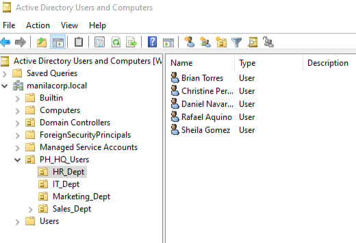
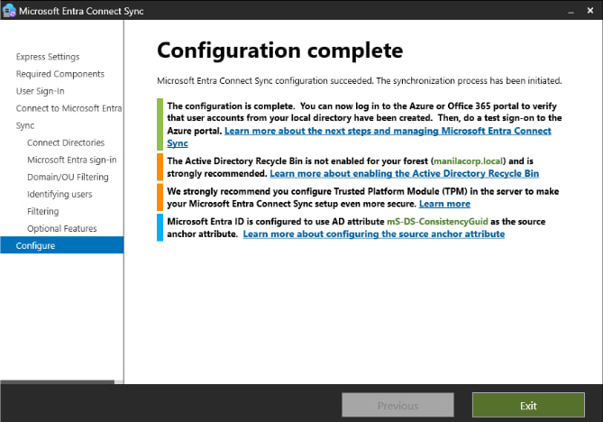
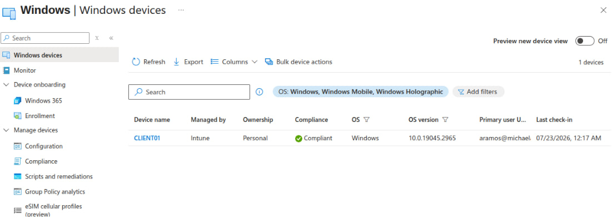
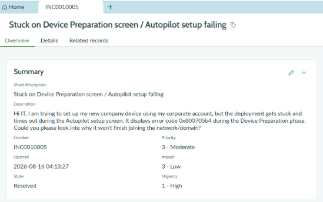

# IT Support & Systems Administration Portfolio

Welcome to my technical portfolio. This repository documents an enterprise-grade IT infrastructure homelab, showcasing hands-on competencies in local systems administration, hybrid identity management, modern endpoint deployment, and IT Service Management (ITSM) lifecycle and knowledge management.

---

## 💼 Business Scenario
Our organization, ManilaCorp, needed to secure remote workstations, enforce security compliance, and automate user onboarding without physical IT intervention, while establishing structured incident management and knowledge-sharing practices. To achieve this, we designed and deployed a scalable hybrid infrastructure bridging on-premises Active Directory with cloud-based endpoint management, backed by a fully integrated ServiceNow IT Service Management (ITSM) platform.

---

## 🛠️ Technical Stack
* **Hypervisors & Virtualization:** Oracle VirtualBox / Hyper-V (Internal Networking)
* **Operating Systems:** Windows Server 2022, Windows 11 Pro (25H2), Windows 10 Pro (22H2)
* **Directory Services & Identity:** Active Directory Domain Services (AD DS), Microsoft Entra ID, Microsoft Entra Connect
* **Endpoint Management & ITSM:** Microsoft Intune, Windows Autopilot, Group Policy (GPO), Intune Connector for Active Directory, ServiceNow (PDI, ITSM, Service Portal, Knowledge Management)
* **Automation:** PowerShell, CSV Batch Provisioning

---

## 🔍 Diagnostic & Troubleshooting Toolkit
To effectively isolate and resolve enterprise incidents, daily operations leverage a suite of built-in Windows utilities, command-line tools, and administrative consoles:
* **Endpoint & MDM Diagnostics:** `mdmdiagnosticstool.exe` (Autopilot log extraction and provisioning telemetry analysis)
* **Identity & Group Policy:** `gpresult /r` (GPO scope and targeted policy evaluation)
* **Service Management:** `services.msc` (Local and remote service control, Print Spooler management)
* **Network Diagnostics:** `ipconfig` (`/release`, `/renew`), `ping`, `netsh winsock reset` (DHCP lease validation and stack flushing)
* **Active Directory & Logs:** `ADUC` (Active Directory Users and Computers), Event Viewer (`Event ID 30120`, `30140` for ODJ connector tracking)
* **ITSM & Knowledge Management:** ServiceNow Incident Lifecycle Management, IT Support Group Routing (`itil`, `itil_admin`), and Known Error Article Publishing.

---

## 🏗️ Lab Architecture Overview

### Phase 1: Local Infrastructure Build (Active Directory)
* Deployed an isolated internal network using a hypervisor housing a Windows Server 2022 Domain Controller and a Windows client VM.
* Configured AD DS, DNS, and DHCP roles for the mock domain `manilacorp.local`.
* Structured organizational units (`PH_HQ_Users`, `IT_Dept`, `Sales_Dept`) and used a PowerShell script to bulk-import 20 mock users via CSV.
* Enforced security baselines, desktop configurations, and access restrictions through Group Policies (GPOs).

  

### Phase 2: Hybrid Identity Bridge (Entra ID)
* Activated a trial sandbox Microsoft 365 Business Premium tenant (`michaelabarintos20gmail.onmicrosoft.com`).
* Configured Microsoft Entra Connect on the local domain controller to bridge on-premises Active Directory objects with the cloud.
* Validated directory synchronization, ensuring PowerShell-provisioned local users replicated successfully to the Entra ID Admin Center.

  

### Phase 3: Modern Endpoint Management (Intune & Autopilot)
* Enabled automatic enrollment so synced cloud accounts register client VMs directly into Microsoft Intune.
* Deployed Compliance Policies (BitLocker, Windows Defender) and Configuration Profiles (restricted USB ports, unified corporate lock screens).
* Silently pushed essential software packages (Google Chrome, M365 Apps) during setup.
* Extracted hardware hashes via PowerShell, configured Autopilot deployment profiles, customized the OOBE sequence, and executed zero-touch provisioning.

  

### Phase 4: ITSM Operations & Knowledge Management (ServiceNow)
* Provisioned a ServiceNow Personal Developer Instance (PDI) to simulate enterprise service desk workflows.
* Configured user groups (`IT Support`), assigned ITIL roles (`itil`, `itil_admin`), and managed incident escalation paths.
* Handled end-to-end incident ticketing from user intake (Service Portal) through tier-2 triage, work-note logging, and formal resolution.
* Bridged technical problem resolution into enterprise documentation by authoring and publishing official Known Error articles within the ServiceNow Knowledge Portal.

  

---

## 🎫 Featured Incident Logs & Tickets

* **[INC0010005: Windows Autopilot ESP Timeout & Hybrid Join Resolution](./tickets/INC0010005.md)**
  * **Status:** Resolved ✅ (Documented via ServiceNow KB `KB0010001`)
  * **Summary:** Bypassed OOBE Enrollment Status Page provisioning timeouts (`0x800705b4`) via a Windows 11 25H2 build upgrade, resolved domain controller routing blocks, verified full hybrid-joined status for client `sgomez`, and converted the resolution into a published Known Error Knowledge Base article.
* **[INC0010007: Microsoft Entra ID Conditional Access Policy Enforcement & Verification](./tickets/INC0010007.md)**
  * **Status:** Resolved ✅
  * **Summary:** Enforced a network-based location restriction policy blocking unauthorized cloud access from untrusted locations, validated via Entra sign-in error logs (53003).
* **[INC0010008: Active Directory Account Lockout & Password Reset Resolution](./tickets/INC0010008.md)**
  * **Status:** Resolved ✅
  * **Summary:** Remediated a locked user account via ADUC, cleared lockout threshold flags, and executed a temporary password reset enforcing a mandatory change at next logon for client `sgomez`.
* **[INC0010009: Workstation IP Configuration & DHCP Lease Troubleshooting](./tickets/INC0010009.md)**
  * **Status:** Resolved ✅
  * **Summary:** Diagnosed and resolved an APIPA network drop (169.254.x.x) resulting from an unidentified network state, verified DHCP client service and gateway connectivity, and successfully restored full IP communication for client `sgomez`.
* **[INC0010020: Print Spooler Recovery & Remote Desktop Connectivity](./tickets/INC0010020.md)**
  * **Status:** Resolved ✅
  * **Summary:** Established a remote desktop connection to client `CLIENT08`, remediated a disabled Print Spooler service via `services.msc`, mapped network printer `PRINTER01` via the AD DC environment, and verified print queue restoration.
#### 📂 Explore All Ticket Documentation
* **[Browse the Full Tickets Directory](./tickets/)**—Access the complete repository folder containing all individual markdown incident files and documentation logs.
