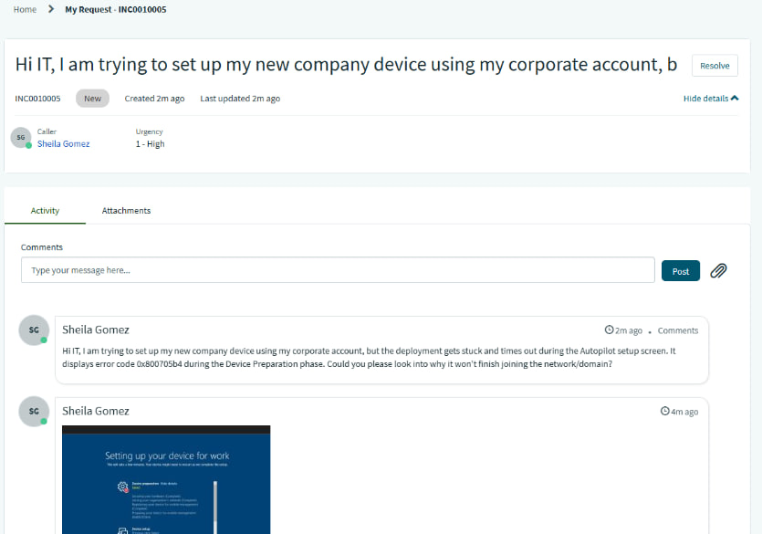
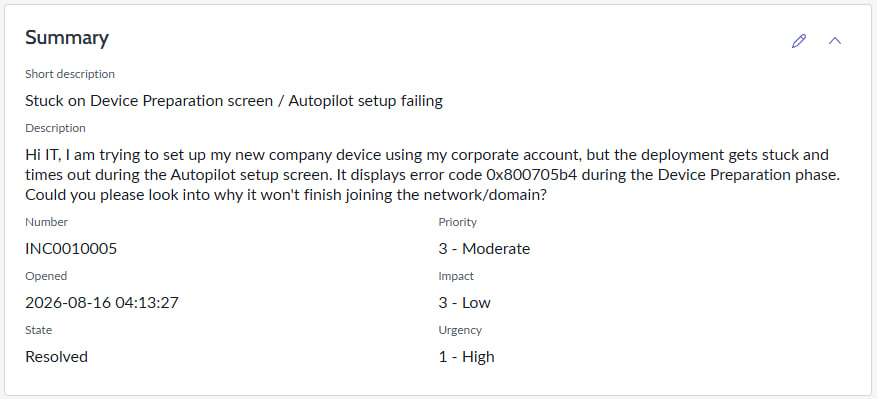
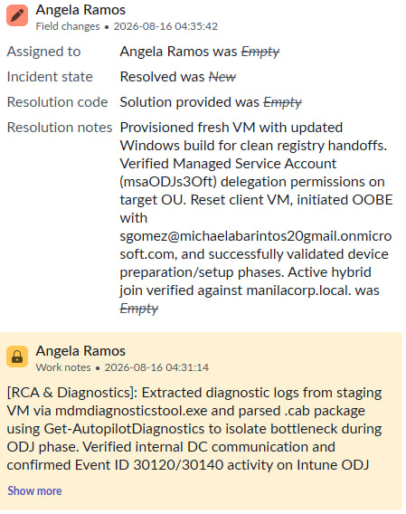
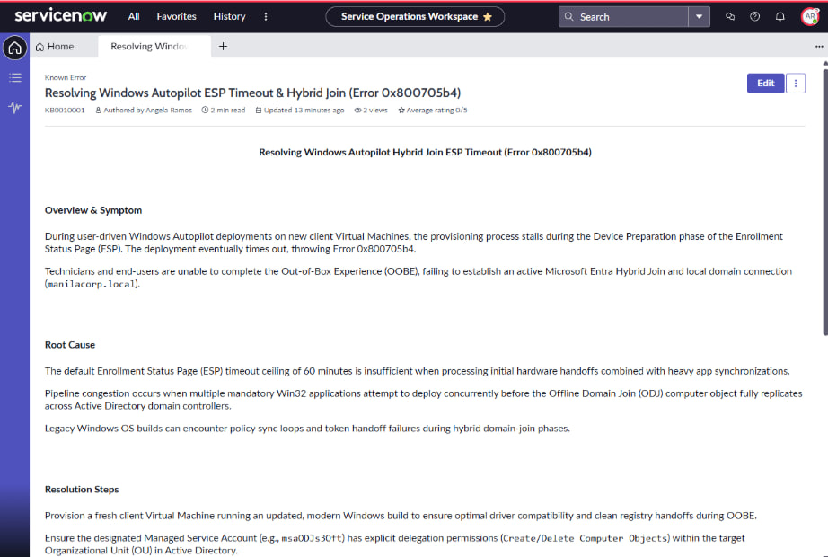

## INC0010005: Windows Autopilot ESP Timeout & Hybrid Join Resolution

---

### Incident Summary
* **Incident ID:** INC0010005
* **Title:** Windows Autopilot ESP Timeout & Hybrid Join Resolution
* **Environment:** Microsoft Entra ID, Microsoft Intune, On-Premises Active Directory, Hypervisor/VirtualBox
* **Impacted Components:** Windows Autopilot User-Driven Hybrid Azure AD Join, Enrollment Status Page (ESP), Intune Connector for Active Directory.

---

### Issue Description
During the initial Windows Autopilot deployment test utilizing a client Virtual Machine, the provisioning process failed during the **Device Preparation** phase of the Enrollment Status Page (ESP). The deployment stalled out and threw **Error 0x800705b4**, signifying a timeout while preparing the device for mobile management and applying the Offline Domain Join (ODJ) blob.

  

---

### Root Cause Analysis (RCA)
1. **ESP Timeout Threshold:** The default ESP configuration imposed a strict 60-minute timeout ceiling, which was exacerbated by concurrent required app installations and network latency bottlenecks during the initial synchronization cycle.
2. **App Deployment Bottlenecks:** Multiple mandatory Win32 applications assigned concurrently during the device-preparation phase caused pipeline congestion before the offline domain join object fully replicated.
3. **Operating System Version Constraints:** Initial testing on legacy builds encountered compatibility stalls with policy synchronization and hardware token handoffs during hybrid execution loops.

---

### Troubleshooting Steps Taken
* **Log Collection & Analysis:** Extracted diagnostic logs from the staging VM via `mdmdiagnosticstool.exe` and parsed the `.cab` package using `Get-AutopilotDiagnostics` to track the exact timeline and locate the bottleneck during the ODJ phase.
* **App & Deployment Adjustments:** Temporarily unassigned heavy multi-app payloads and required Win32 app deployments to isolate the provisioning pipeline and clear sync congestion.
* **Profile Configuration Updates:** Modified the Autopilot Deployment Profile group inclusions to globally target **All devices**, and updated the ESP profile settings (extending the timeout threshold from 60 to 90 minutes and adjusting blocking policies).
* **Infrastructure & Network Verification:** Ensured healthy FQDN resolution, internal domain controller communication via `nslookup` and `ping`, and verified successful event log activities (`Event ID 30120` and `30140`) on the local Intune ODJ Connector service (`WIN-ENRKJBF36KU`).

---

### Resolution & Implementation
1. **OS Migration:** Provisioned a fresh Virtual Machine running an updated Windows build to ensure optimal driver compatibility and clean registry handoffs during OOBE.
2. **Active Directory & Connector Validation:** Verified that the Managed Service Account (`msaODJs3Oft`) possessed precise delegation permissions to create computer objects within the designated target Organizational Unit (OU).
3. **Execution & Sign-in:** Reset the target client VM, initiated the Windows Autopilot OOBE routine utilizing a freshly licensed Microsoft Entra user account (`sgomez@michaelabarintos20gmail.onmicrosoft.com`), and authenticated into the local domain (`manilacorp.local`).
4. **Verification:** 
   * Confirmed successful completion of the **Device Preparation** and **Device Setup** phases on the Enrollment Status Page.
   * Verified successful automated deployment of pushed software packages (such as Google Chrome and Microsoft 365 apps via Company Portal).
   * Validated system properties showing active **Microsoft Entra hybrid joined** status linked directly to `manilacorp.local` and managed by **Default Directory** (Intune).

---
  
### ITSM Incident Lifecycle & Knowledge Documentation (ServiceNow)
* **Ticket Intake (Service Portal):** The impacted end-user (`sgomez`, Sheila Gomez) submitted the incident ticket via the ServiceNow Service Portal (`INC0010005`).
* **Triage & Assignment:** Switched security contexts and impersonated tier-2 support (`aramos`, Angela Ramos). Routed the ticket to the **IT Support** assignment group and assigned ownership to Angela Ramos.
* **Work Notes & Diagnostics:** Logged active diagnostic steps and troubleshooting progress directly into the incident work notes.
* **Resolution Details:** Updated the Resolution Information tab by setting the Resolution Code to **“Solution Provided”**, appending detailed resolution notes outlining the hybrid join fixes.

  

* **Knowledge Management Integration:** Navigated to the ServiceNow Knowledge Portal to transform the resolved troubleshooting steps into a formal Known Error article (`KB0010001`), ensuring future team-wide reference for Autopilot ESP timeout remediation.

  

