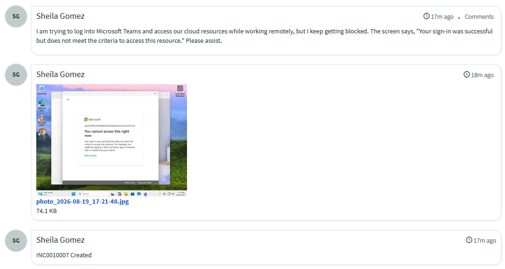
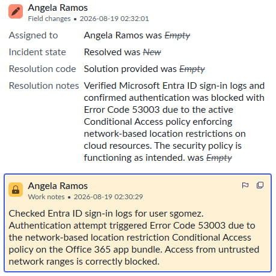
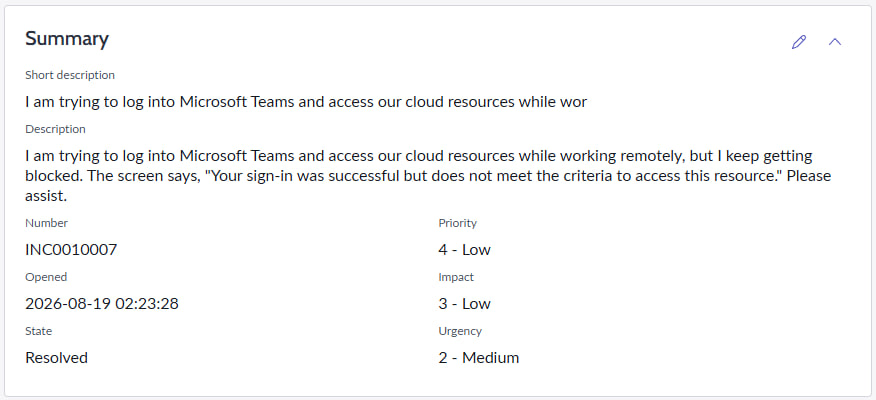
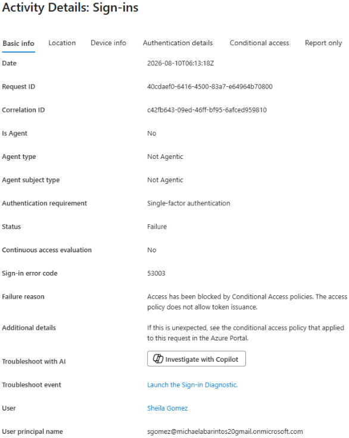

## INC0010007: Microsoft Entra ID Conditional Access Policy Enforcement & Verification

---

### Incident Summary
* **Incident ID:** INC0010007
* **Date / Time:** 2026-08-10
* **Category:** Identity and Access Management (IAM) / Microsoft Entra ID
* **Severity:** Medium (Security Compliance Enforcement)
* **Status:** Resolved / Documented

---

### Issue Description
Simulated and enforced an access restriction policy targeting unauthorized sign-in attempts from untrusted networks. Test user attempts to access Microsoft Teams and cloud resources from outside corporate-approved IP ranges resulted in an enforced authentication block prompt (*Error Code: **53003***).

  

---

### Configuration & Implementation
* **Target Resources:** Scoped the Conditional Access policy to the **Office 365** application bundle (covering Teams, SharePoint, and Exchange).
* **Conditions:** Configured network conditions to include **Any network or location** while explicitly excluding **Multifactor authentication trusted IPs**.
* **Access Controls:** Configured the grant control to **Block access** for all matching out-of-network requests.

---

### Validation & Troubleshooting
* **User-Facing Behavior:** Attempting to log into Microsoft Teams triggered the policy block interface with the message: *"Your sign-in was successful but does not meet the criteria to access this resource."*
* **Audit Trail Verification:** Inspected the Microsoft Entra ID **Sign-in logs**, confirming that the authentication attempt failed with **Error Code 53003** and successfully matched the custom Conditional Access rule.

---

### ITSM Incident Lifecycle & Knowledge Documentation (ServiceNow)
* **Ticket Intake (Service Portal):** The impacted end-user (`sgomez`, Sheila Gomez) submitted the conditional access blockage ticket via the ServiceNow Service Portal (`INC0010007`).
* **Triage & Assignment:** Switched security contexts and impersonated tier-2 support (`aramos`, Angela Ramos), routing the ticket to the **IT Support** group.
* **Work Notes & Diagnostics:** Logged diagnostic findings verifying that user `sgomez` triggered sign-in error `53003` due to network location restrictions.
* **Resolution Details:** Updated the Resolution Information tab, set the Resolution Code to **“Solution provided”**, and documented that the security perimeter control is operating as intended.

  

* **Audit & Sign-In Verification:** Cross-referenced Entra ID audit logs and incident activity tracking to confirm compliance enforcement.

  

