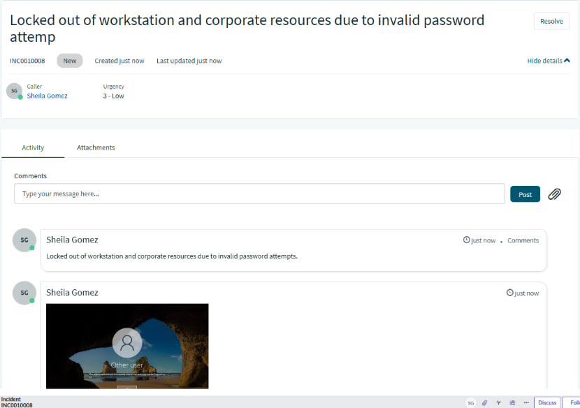
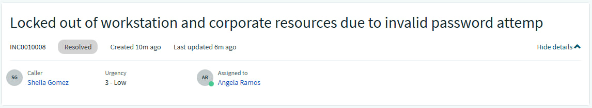
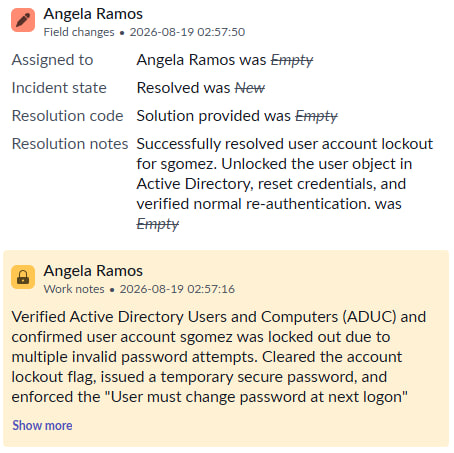
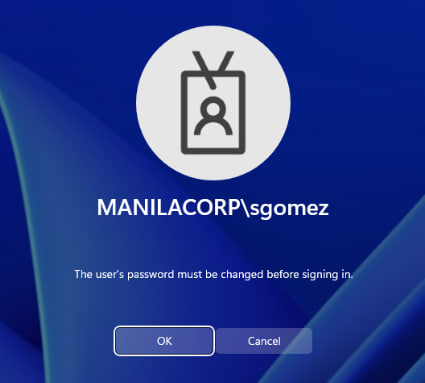
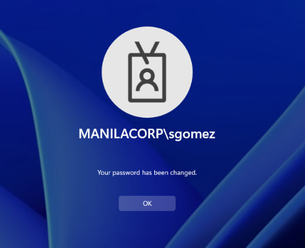

## INC0010008: Active Directory Account Lockout & Password Reset Resolution

---

### Incident Summary
* **Incident ID:** INC0010008
* **Title:** Active Directory Account Lockout & Password Reset Resolution
* **Environment:** On-Premises Active Directory, Active Directory Users and Computers (ADUC), ServiceNow PDI
* **Impacted Components:** User Identity Management, Domain Authentication Services, Helpdesk Ticketing

---

### Issue Description
User `sgomez` reported being locked out of their workstation and corporate resources following multiple incorrect password attempts after a recent credential expiration.

  

---

### Diagnostics & Investigation
* **Directory Verification:** Accessed **Active Directory Users and Computers (ADUC)** on the domain controller and navigated to the target user object for `sgomez` under the designated organizational unit.
* **Status Confirmation:** Verified that the account was flagged in a locked-out state due to threshold security violations, preventing successful domain re-authentication.

---

### Remediation & Resolution
1. **Account Unlock:** Cleared the lockout flag by selecting the **"Unlock the user's account"** option via the ADUC account management window.
2. **Credential Reset:** Issued a temporary secure password and enforced the **"User must change password at next logon"** policy rule to maintain security standards.
3. **Verification:** Confirmed account recovery and notified the user to complete a secure credential update upon re-authentication.

---
  
### ITSM Incident Lifecycle & Knowledge Documentation (ServiceNow)
* **Ticket Intake (Service Portal):** The impacted end-user (`sgomez`, Sheila Gomez) submitted the account lockout assistance request via the ServiceNow Service Portal (`INC0010008`).
* **Triage & Assignment:** Switched security contexts and impersonated tier-2 support (`aramos`, Angela Ramos). Routed the ticket to the **IT Support** assignment group and assigned ownership to Angela Ramos.
* **Work Notes & Diagnostics:** Logged active diagnostic steps, noting the ADUC verification and account unlock procedures directly into the incident work notes.
* **Resolution Details:** Updated the Resolution Information tab by setting the Resolution Code to **“Solution Provided”**, appending detailed resolution notes outlining the account unlock and password reset actions.

  

---

### Evidence & Documentation
| Active Directory Account Remediation & Unlock |
| :---: |
| 

 |
| 

 |
