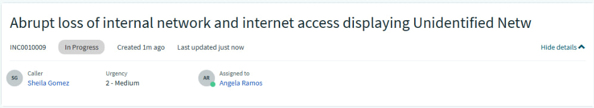
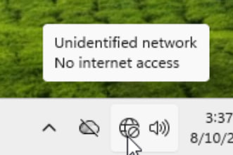
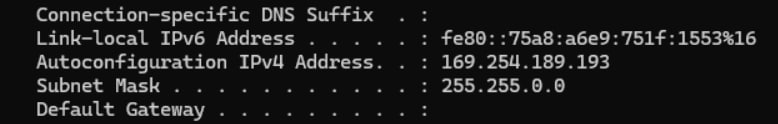
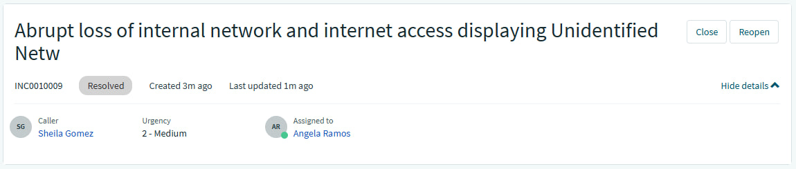
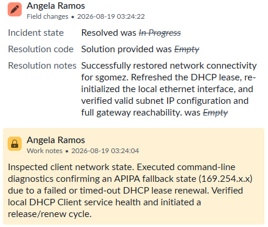

## INC0010009: Workstation IP Configuration & DHCP Lease Troubleshooting

---

### Incident Overview
* **Incident ID:** INC0010009
* **Title:** Workstation IP Configuration & DHCP Lease Troubleshooting
* **Environment:** Client Operating System, Local Network Services, ServiceNow PDI
* **Impacted Components:** Local Area Network (LAN), DHCP Client Service, IP Configuration Routing

---

### Issue Description
User `sgomez` reported an abrupt loss of internal network and internet access, displaying an **"Unidentified network / No internet access"** status on the taskbar.

---

### Diagnostics & Investigation
1. **Initial Assessment:** Inspected the client notification area and confirmed a yellow warning icon indicating a lack of valid network routing.
2. **Command-Line Analysis:** Executed command-line diagnostics (`ipconfig`), revealing an Autoconfiguration IPv4 address (`169.254.189.193`) with a missing Default Gateway, confirming an **APIPA (Automatic Private IP Addressing)** fallback state.

  

3. **Service & Path Verification:** Verified that the local **DHCP Client** service was running, checked IP helper services, and validated local adapter communication channels.

---

### Remediation & Resolution
1. **DHCP Scope Request:** Initiated a fresh IP lease request (`ipconfig /renew`) to clear out the stale configuration profile and bind to the active subnet scope.
2. **Interface Reset:** Toggled the local network adapter interface state (disabled and re-enabled the ethernet connection) to re-initialize hardware communication layers.
3. **Verification:** Confirmed successful acquisition of a valid subnet IP address and restoration of full internal network and internet functionality.

---
  
### ITSM Incident Lifecycle & Knowledge Documentation (ServiceNow)
* **Ticket Intake (Service Portal):** The impacted end-user (`sgomez`, Sheila Gomez) submitted the network connectivity issue via the ServiceNow Service Portal (`INC0010009`).
* **Triage & Assignment:** Switched security contexts and impersonated tier-2 support (`aramos`, Angela Ramos). Routed the ticket to the **IT Support** assignment group and assigned ownership to Angela Ramos.
* **Work Notes & Diagnostics:** Logged active diagnostic steps, noting the APIPA address identification and DHCP lease troubleshooting directly into the incident work notes.
* **Resolution Details:** Updated the Resolution Information tab by setting the Resolution Code to **“Solution Provided”**, appending detailed resolution notes outlining the network adapter reset and DHCP renewal fixes.

