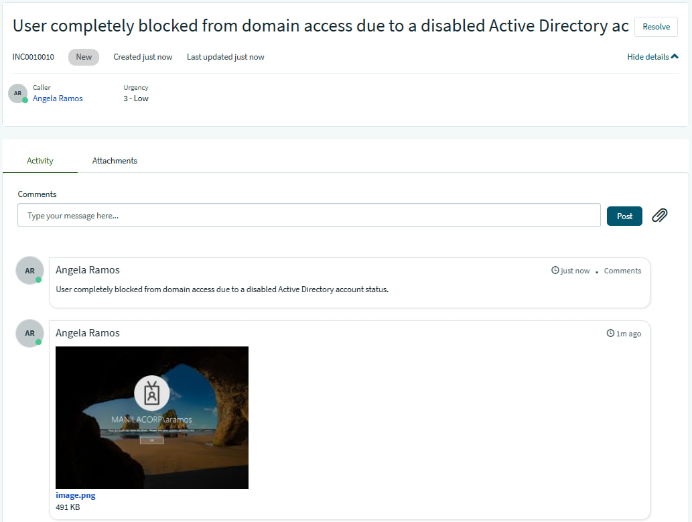
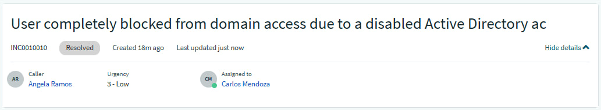
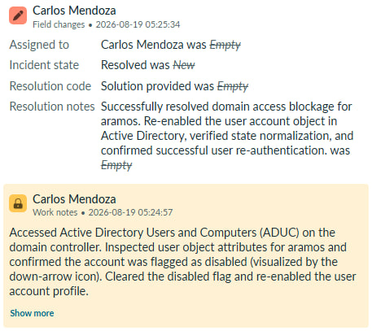
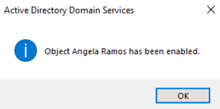

## INC0010010: Active Directory Disabled Account Remediation

---

### Incident Overview
* **Incident ID:** INC0010010
* **Title:** Active Directory Disabled Account Remediation
* **Environment:** On-Premises Active Directory, Active Directory Users and Computers (ADUC), ServiceNow PDI
* **Impacted Components:** User Identity Management, Domain Authentication Services, Active Directory Account States

---

### Issue Description
User `aramos` reported being completely blocked from accessing corporate domain resources, presenting an explicit authentication error stating that their user account has been disabled.

---

### Diagnostics & Investigation
1. **Directory Search:** Accessed **Active Directory Users and Computers (ADUC)** on the domain controller and navigated to the target user object.
2. **Visual & Attribute Verification:** Identified the visual indicator (down-arrow icon) on the user object and confirmed via the Account properties tab that the account flag was set to disabled.

---

### Remediation & Resolution
1. **Account Enablement:** Modified the account properties in ADUC to clear the disabled flag and re-enabled the user profile.
2. **State Verification:** Refreshed the directory container to confirm status normalization and instructed the user to re-authenticate successfully.

---
  
### ITSM Incident Lifecycle & Knowledge Documentation (ServiceNow)
* **Ticket Intake (Service Portal):** The impacted end-user (`aramos`, Angela Ramos) submitted the account access request via the ServiceNow Service Portal (`INC0010010`).
* **Triage & Assignment:** Routed the ticket to the **IT Support** assignment group and assigned ownership for handling directory remediation.
* **Work Notes & Diagnostics:** Logged active troubleshooting steps detailing the ADUC account attribute inspection and enablement procedures directly into the incident work notes.
* **Resolution Details:** Updated the Resolution Information tab by setting the Resolution Code to **“Solution Provided”**, appending detailed resolution notes outlining the Active Directory account fix.

---

### Evidence & Documentation
Active Directory Account Status Remediation

