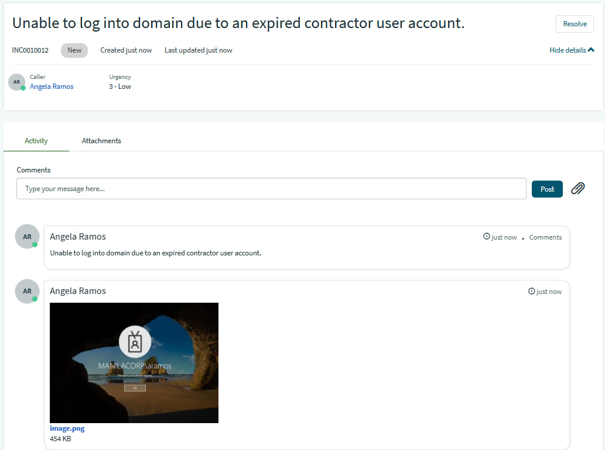
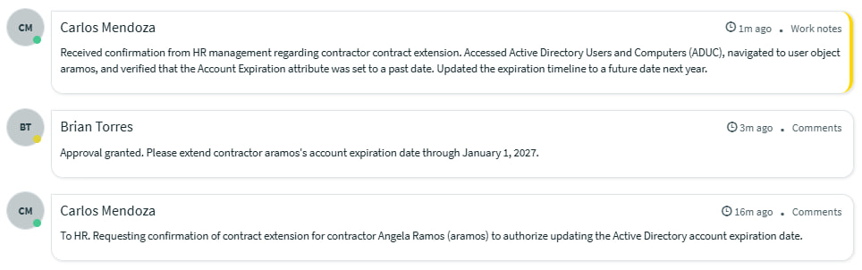
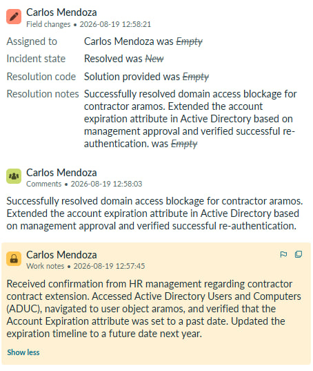
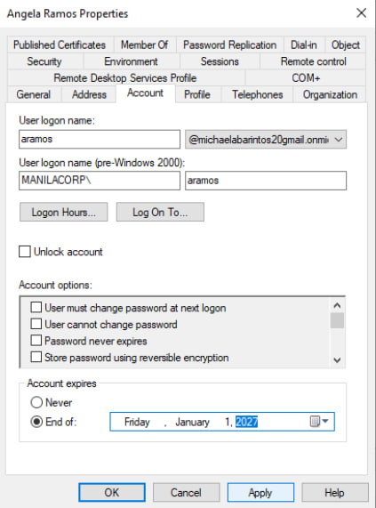

## INC0010012: Active Directory Expired Account Remediation & Extension

---

### Incident Overview
* **Incident ID:** INC0010012
* **Title:** Active Directory Expired Account Remediation & Extension
* **Environment:** On-Premises Active Directory, Active Directory Users and Computers (ADUC), ServiceNow PDI
* **Impacted Components:** User Identity Management, Domain Authentication Services, Contractor Account Lifecycles

---

### Issue Description
User `aramos` (Contractor) reported being unable to authenticate into the domain, presenting an explicit error message stating that their user account has expired due to a reached temporary timeline limit.

---

### Diagnostics & Investigation
1. **Directory Inspection:** Accessed **Active Directory Users and Computers (ADUC)** on the domain controller and opened the properties for user `aramos`.
2. **Attribute Verification:** Navigated to the Account tab and confirmed that the account expiration attribute was set to a past date, resulting in automated access denial.
3. **Administrative Validation:** Coordinated via ServiceNow comments with department management to confirm contract renewal and authorize account extension.

---

### Remediation & Resolution
1. **Attribute Modification:** Updated the account expiration settings in ADUC from the expired date to a new authorized timeline extending into the following year.
2. **Access Restoration:** Applied changes and verified that the user was immediately able to successfully re-authenticate to the domain.

---
  
### ITSM Incident Lifecycle & Knowledge Documentation (ServiceNow)
* **Ticket Intake (Service Portal):** The impacted end-user (`aramos`, Angela Ramos) submitted the account expiration access request via the ServiceNow Service Portal (`INC0010012`).
* **Triage & Assignment:** Routed the ticket to the **IT Support** assignment group, utilizing portal communications to verify management approval for the contract extension.
* **Work Notes & Diagnostics:** Logged active troubleshooting steps detailing the ADUC account expiration attribute inspection and timeline adjustments directly into the incident work notes.
* **Resolution Details:** Updated the Resolution Information tab by setting the Resolution Code to **“Solution Provided”**, appending detailed resolution notes outlining the Active Directory account extension.

---

### Evidence & Documentation
Active Directory Account Expiration Configuration & Extension

