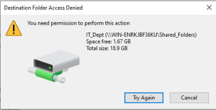
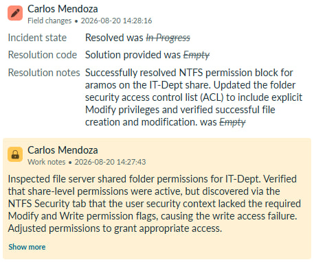
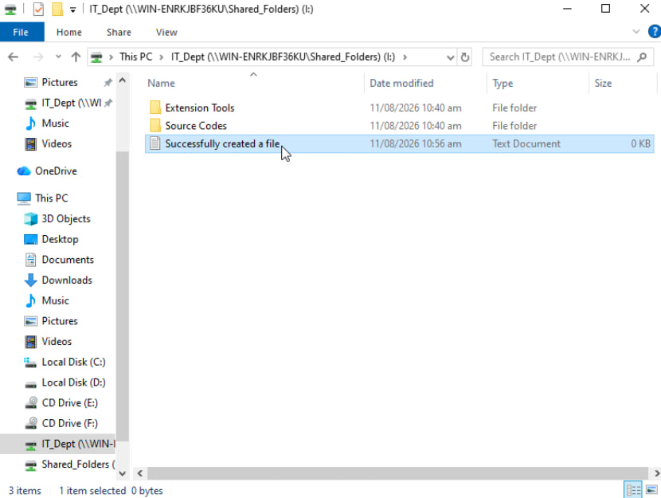
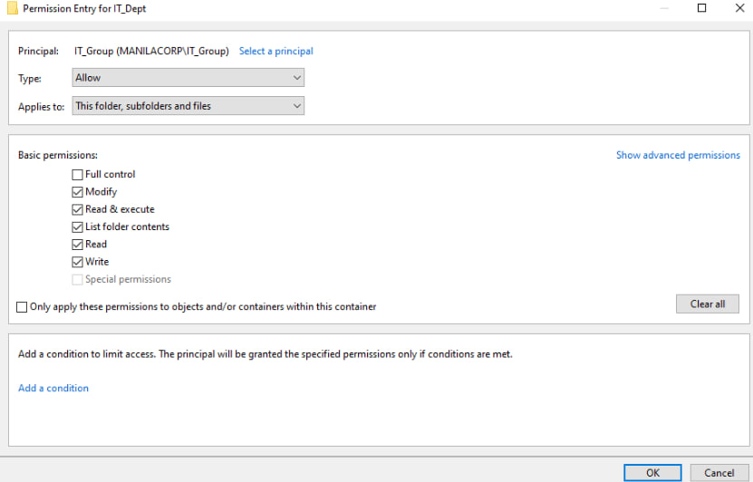

## INC0010013: File Server Shared Folder Access Denied & NTFS Permission Resolution

---

### Incident Overview
* **Incident ID:** INC0010013
* **Title:** File Server Shared Folder Access Denied & NTFS Permission Resolution
* **Environment:** Windows File Server, NTFS Security Permissions, SMB Share Configuration, ServiceNow PDI
* **Impacted Components:** Network File Shares, Access Control Lists (ACL), User Authorization & Write Privileges

---

### Issue Description
User `aramos` (Angela Ramos) reported that while she can successfully view and access the `IT-Dept` network shared folder, she encounters an **"Access Denied"** error whenever attempting to create, edit, or delete files within the directory.

---

### Diagnostics & Investigation
1. **Initial Assessment:** Verified network path reachability and confirmed share-level permissions were correctly assigned.
2. **NTFS Security Inspection:** Examined the folder properties of `IT-Dept` on the file server and navigated to the **Security** tab to review user group memberships and effective permissions.
3. **Root Cause Identification:** Discovered that the wrong type of NTFS access was configured, specifically missing the **Modify** and **Write** permission flags for the user's security context.

---

### Remediation & Resolution
1. **Permission Adjustment:** Updated the NTFS security access control list (ACL) on the `IT-Dept` folder to grant explicit **Modify** permissions to the target user account/security group.
2. **Access Verification:** Applied changes and instructed user `aramos` to re-test file operations, confirming successful file creation, editing, and deletion within the share.

---
  
### ITSM Incident Lifecycle & Knowledge Documentation (ServiceNow)
* **Ticket Intake (Service Portal):** The impacted end-user (`aramos`, Angela Ramos) submitted the shared folder permission issue via the ServiceNow Service Portal (`INC0010013`).
* **Triage & Assignment:** Routed the ticket to the **IT Support** assignment group and assigned ownership for handling file server access adjustments.
* **Work Notes & Diagnostics:** Logged active troubleshooting steps detailing the NTFS security tab inspection and missing Modify permissions directly into the incident work notes.
* **Resolution Details:** Updated the Resolution Information tab by setting the Resolution Code to **“Solution Provided”**, appending detailed resolution notes outlining the NTFS permission fix.

---

### Evidence & Documentation
NTFS Security Permission Modification & Access Restoration

