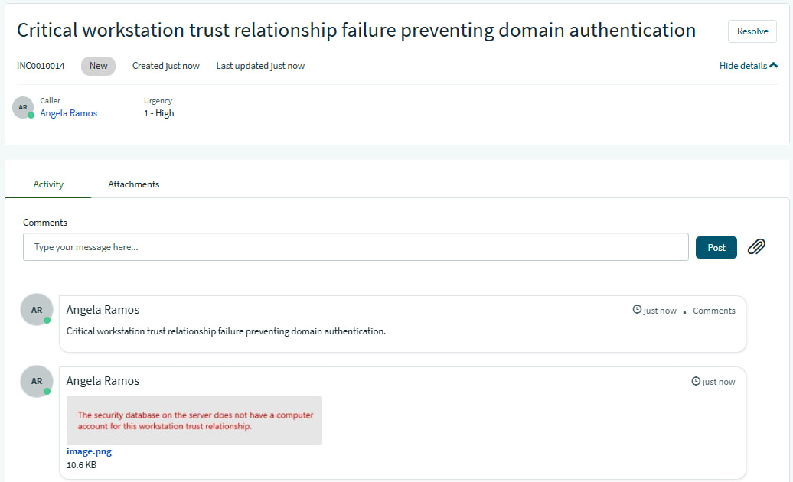
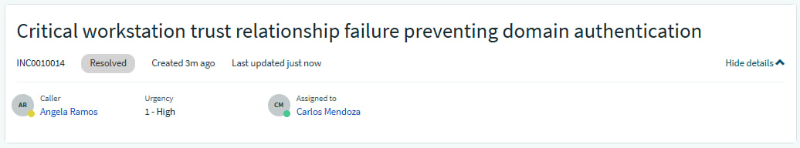
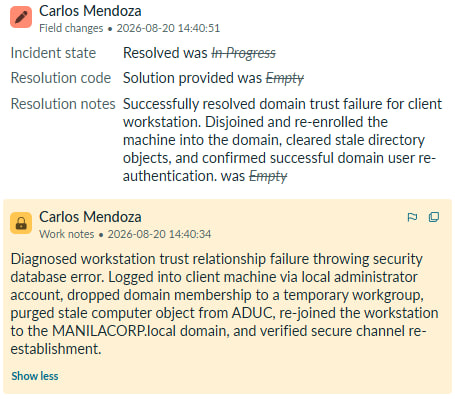
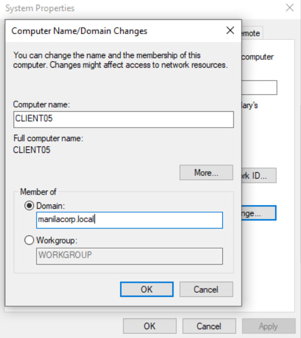
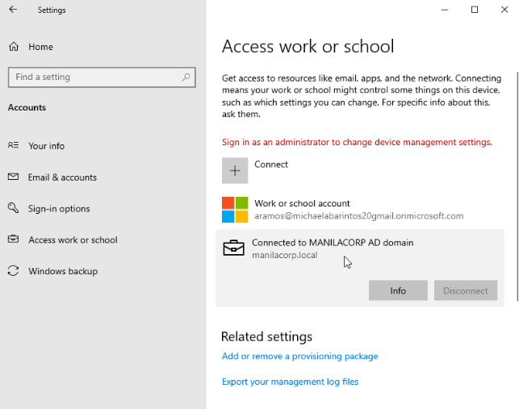
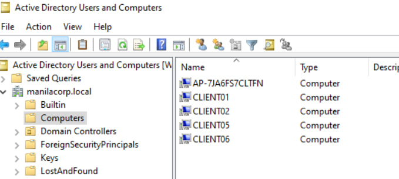

## INC0010014: Workstation Trust Relationship Failure & Domain Re-enrollment

---

### Incident Overview
* **Incident ID:** INC0010014
* **Title:** Workstation Trust Relationship Failure & Domain Re-enrollment
* **Environment:** On-Premises Active Directory, Windows Workstation, Active Directory Users and Computers (ADUC), ServiceNow PDI
* **Impacted Components:** Secure Channel Communications, Machine Trust Accounts, Domain Authentication Services

---

### Issue Description
Client workstation encountered a critical domain authentication failure during administrative and user logon workflows, presenting the error message: **"The security database on the server does not have a computer account for this workstation trust relationship."**

---

### Diagnostics & Investigation
1. **Authentication Failure Analysis:** Identified that secure channel communication between the client machine and the Domain Controller was severed because the computer object was deleted, reset, or fell out of sync due to prolonged inactivity or disconnection.
2. **Local Elevation Block:** Attempted administrative actions on the machine, which resulted in UAC token rejection due to the broken trust relationship state.

---

### Remediation & Resolution
1. **Local Access Override:** Logged into the workstation utilizing the local administrator account context (`.\CLIENT05`) to bypass domain authentication barriers.
2. **Domain Disconnection:** Navigated to system settings via **This PC > Properties > Rename this PC (advanced)**, temporarily unjoined the machine from the domain by shifting its membership to a standalone workgroup, followed by a system reboot.
3. **Directory Hygiene:** Ensured the stale computer object was completely purged from Active Directory Users and Computers (ADUC) to prevent name collision errors during re-enrollment.
4. **Domain Re-enrollment:** Re-joined the workstation back to the `MANILACORP.local` domain using domain administrative credentials and performed a final system restart.
5. **Verification:** Successfully signed into the workstation using domain user credentials (`MANILACORP\aramos`), confirming full restoration of the secure channel and domain policy synchronization.

---
  
### ITSM Incident Lifecycle & Knowledge Documentation (ServiceNow)
* **Ticket Intake (Service Portal):** The impacted end-user (`aramos`, Angela Ramos) submitted the domain trust failure issue via the ServiceNow Service Portal (`INC0010014`).
* **Triage & Assignment:** Routed the ticket to the **IT Support** assignment group and assigned ownership for handling enterprise machine trust recovery.
* **Work Notes & Diagnostics:** Logged active troubleshooting steps detailing the local account fallback, workgroup shift, ADUC container cleaning, and domain re-enrollment directly into the incident work notes.
* **Resolution Details:** Updated the Resolution Information tab by setting the Resolution Code to **“Solution Provided”**, appending detailed resolution notes outlining the secure channel restoration.

---

### Evidence & Documentation
Workstation Trust Relationship Failure & Domain Re-enrollment Proof

