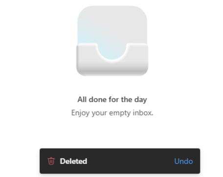
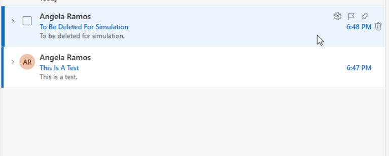
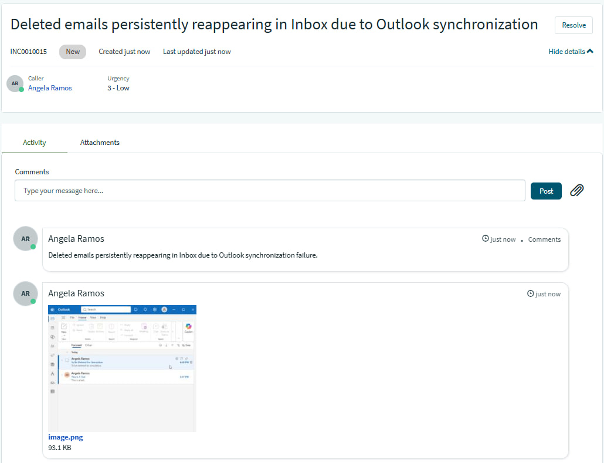
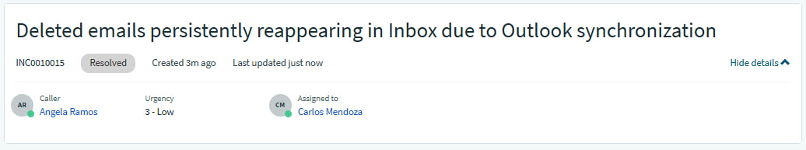
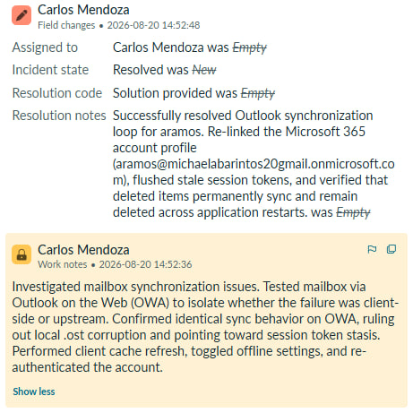
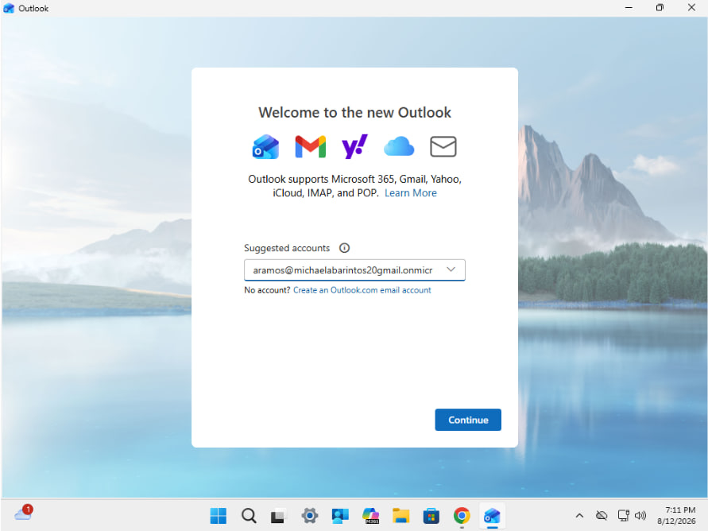
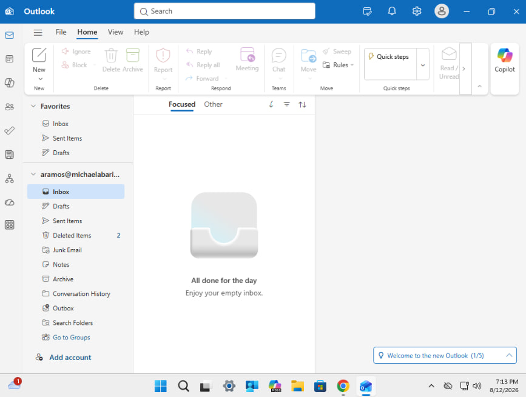

## INC0010015: Outlook Data File Corruption & Sync Failure

---

### Incident Summary

* **Incident ID:** INC0010015
* **Title:** Outlook Data File Corruption & Sync Failure
* **Environment:** Microsoft 365, Modern Outlook Desktop Client, Outlook on the Web (OWA), ServiceNow PDI
* **Impacted Components:** User Mailbox Sync Stream, Local Client Caching Parameters, Account Authentication Tokens.

---

### Issue Description

User reported that deleted emails were persistently reappearing in the Inbox after starting Outlook again, indicating that the client failed to properly sync deletion flags upstream to the mail server.

| BEFORE | AFTER |
| :---: | :---: |
|  |  |

---

### Root Cause Analysis (RCA)

1. **Synchronization Loop:** Local client deletion actions appeared to clear successfully on the user's screen initially, but failed to commit upstream, causing items to loop back into the active view upon application restart.
2. **Server-Side State Delay / Retention Rules:** Testing across both the desktop client and web interface demonstrated identical sync behavior, pointing toward a server-side state delay or active synchronization bottleneck rather than localized `.ost` corruption.
3. **Authentication & Session Stale Tokens:** Cached credentials and active session states trapped the client in an out-of-sync loop with the Exchange server.

---

### Troubleshooting Steps Taken

* **Diagnostics & Web Isolation:** Tested the mailbox via Outlook on the Web (`outlook.office.com`) to isolate whether the failure was localized to the client data store or occurring upstream. Confirmed that identical synchronization behavior occurred on the web interface, which ruled out local `.ost` data file corruption and pointed toward a server-side state delay or active sync bottleneck.
* **Client-Side Cache Refresh:** Toggled local offline caching parameters under **Settings > General > Offline** to force the modern client to clear its local state and re-establish a healthy sync stream with the Exchange server.
* **Session Refresh / Re-authentication:** Signed out of the Outlook account to flush cached credentials and active session tokens, then signed back in to force a fresh authentication handshake and server synchronization session.

---

### Resolution & Implementation

1. **Account Re-linking:** Removed and re-added the affected user account (`aramos@michaelabarintos20gmail.onmicrosoft.com`) within the modern Outlook application settings to purge corrupted local session states.
2. **Re-authentication Handshake:** Successfully signed back into the Microsoft 365 environment, forcing a clean configuration download and fresh connection pipeline with Exchange.
3. **Verification:** Confirmed that deleted items stayed permanently gone and did not reappear upon subsequent application restarts, proving that the synchronization loop and caching issue were completely resolved.

---
  
### ITSM Incident Lifecycle & Knowledge Documentation (ServiceNow)
* **Ticket Intake (Service Portal):** The impacted end-user (`aramos`, Angela Ramos) submitted the mailbox synchronization issue via the ServiceNow Service Portal (`INC0010015`).
* **Triage & Assignment:** Routed the ticket to the **IT Support** assignment group and assigned ownership for handling client-side cloud application troubleshooting.
* **Work Notes & Diagnostics:** Logged active troubleshooting steps detailing the OWA isolation testing, cache toggling, and account re-linking procedures directly into the incident work notes.
* **Resolution Details:** Updated the Resolution Information tab by setting the Resolution Code to **“Solution Provided”**, appending detailed resolution notes outlining the Exchange synchronization fix.

---

### Evidence & Documentation
Outlook Synchronization Resolution Proof

