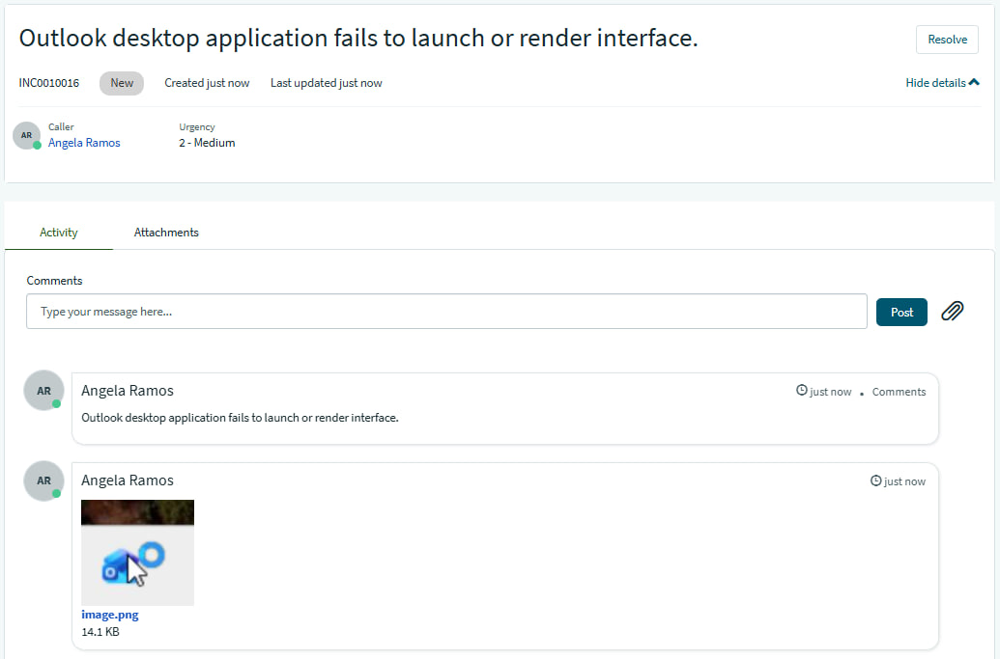
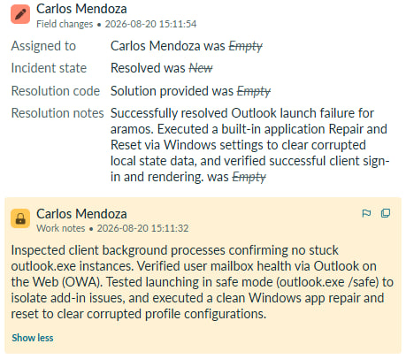
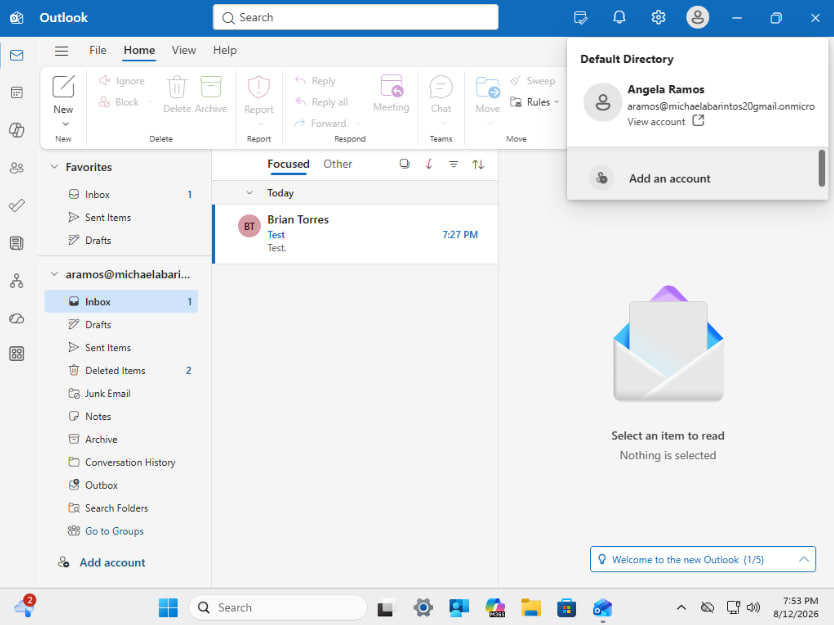
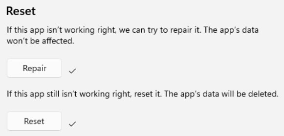

## INC0010016: Outlook Application Launch Failure & Non-Responsive State

---

### Incident Summary
* **Incident ID:** INC0010016
* **Title:** Outlook Application Launch Failure & Non-Responsive State
* **Environment:** Microsoft 365, Modern Outlook Desktop Client, Windows 11, ServiceNow PDI
* **Impacted Components:** Mail Client Executable, Local Profile Data Store, Windows Application Process.

---

### Issue Description
The user reported that the Outlook desktop application completely failed to open when clicked. Selecting the application shortcut produced a brief loading cursor or background process entry, but the graphical interface failed to render, leaving the user completely unable to access their email client locally.

---

### Root Cause Analysis (RCA)
1. **Application Process Hang / Failure to Initialize:** Core executable failed to spawn a graphical user interface upon invocation.
2. **Local Data Store & Cache Corruption:** Damage within the local cache or profile configuration files prevented the executable from completing its initial handshake.
3. **Corrupted App State:** Damaged local application state files or corrupted registry configuration flags caused the client to silently fail during execution.

---

### Troubleshooting & Diagnostics
* **Process & Hang Analysis:** Confirmed no `outlook.exe` or `olk.exe` are running in the background processes, ruling out process lockouts.
* **Cloud vs. Client Isolation:** Verified functionality via Outlook on the Web (`outlook.office.com`) to confirm that the underlying user mailbox and cloud infrastructure remained fully operational while the local client was unresponsive.
* **Safe Mode Diagnostic Test:** Used the Windows Run dialog (`Win + R`) to execute `outlook.exe /safe`, isolating potential third-party add-in or extension conflicts during startup.

---

### Resolution & Implementation
* **App State Repair & Reset:** Navigated to Windows **Settings > Apps > Installed Apps**, located Microsoft Outlook, and executed the built-in **Repair** and **Reset** options to clear out corrupted local caches and temporary state data.
* **Verification & Testing:** Relaunched the Outlook application from the shortcut. Successfully logged back in and can open the application without stopping or crashing.

---
  
### ITSM Incident Lifecycle & Knowledge Documentation (ServiceNow)
* **Ticket Intake (Service Portal):** The impacted end-user (`aramos`, Angela Ramos) submitted the application launch failure via the ServiceNow Service Portal (`INC0010016`).
* **Triage & Assignment:** Routed the ticket to the **IT Support** assignment group and assigned ownership for handling client-side desktop application troubleshooting.
* **Work Notes & Diagnostics:** Logged active troubleshooting steps detailing the background process checks, OWA isolation, safe mode testing, and Windows app reset procedures directly into the incident work notes.
* **Resolution Details:** Updated the Resolution Information tab by setting the Resolution Code to **“Solution Provided”**, appending detailed resolution notes outlining the Outlook repair fix.

---

### Evidence & Documentation
Outlook Application Launch Failure & Successful Restoration

