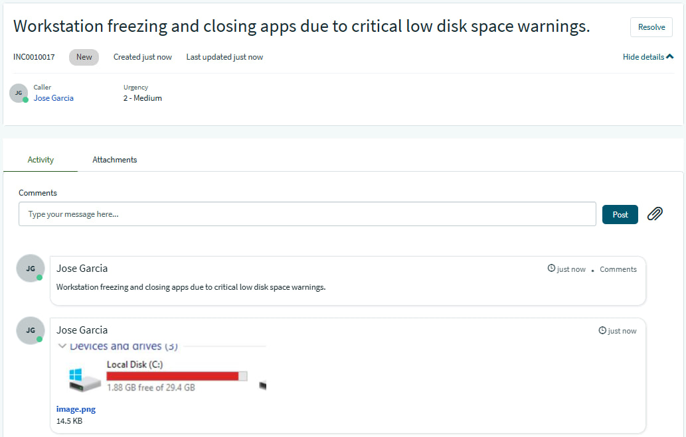
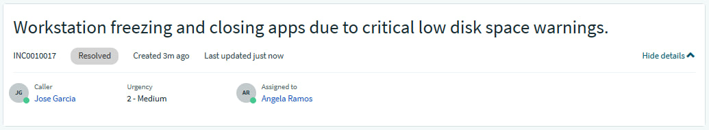
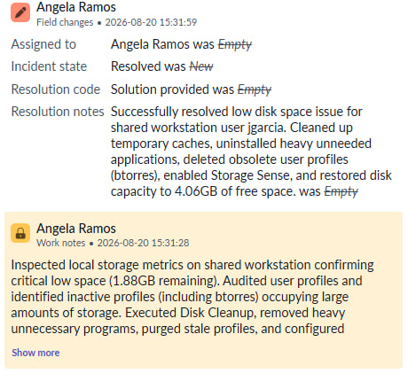
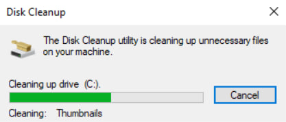
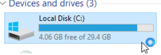

## INC0010017: Local Disk Space Optimization on Shared Workstations

---

### Incident Summary
* **Incident ID:** INC0010017
* **Title:** Local Disk Space Optimization on Shared Workstations
* **Environment:** Windows 10, Multi-User Shared Desktop Environment, ServiceNow PDI
* **Impacted Components:** Local Operating System Drive (`C:`), User Profiles Directory, System Storage Cache.

---

### Issue Description
The user reported that the workstation was experiencing critical low disk space warnings (leaving only 1.88GB of free space). As a result, the computer was constantly freezing, failing to write temporary files, and abruptly closing active work applications.

---

### Root Cause Analysis (RCA)
1. **Stale User Profiles:** On shared workstations utilized by multiple staff members, user profiles accumulate over time and consume vast amounts of local storage.
2. **Abandoned Data:** Profiles left behind by inactive users (such as the `btorres` account and other unused profiles) occupied valuable gigabytes on the system drive.
3. **Cache and Temp File Accumulation:** Uncleaned temporary installation files, system logs, and general application caches filled up the remaining free sectors of the `C:` drive, causing performance degradation for the active user (`jgarcia`).

---

### Troubleshooting & Diagnostics
* **Storage Inspection:** Opened **This PC**, right-clicked the local OS drive (`C:`), and accessed **Properties** to review free space metrics and verify the critical low capacity warning.
* **Profile Audit:** Navigated to **System Properties > Advanced > User Profiles** to review the list of profiles, their sizes, and their last modified/login dates to identify which accounts belonged to inactive or former users.

---

### Resolution & Implementation
* **Disk Cleanup & Application Purging:** Opened the `C:` drive Properties window, clicked **Disk Cleanup**, checked the boxes for the recycle bin, temporary files, system logs, and previous Windows installations, and selected **Clean up system files** to purge unnecessary cache. Additionally, uninstalled heavy programs that were no longer necessary for workstation operations.
* **Stale Profile Removal:** Selected obsolete or inactive user profiles (such as `btorres` and other unused profiles) in the User Profiles window after confirming their last login dates to instantly reclaim gigabytes of storage.
* **Storage Sense Configuration:** Enabled Windows **Storage Sense** to automate the cleanup of temporary files, configured the Recycle Bin to automatically delete files older than 30 days, and set it to clear items in the Downloads folder that haven't been opened for more than 30 days.

---

### Validation & Testing
* **Storage Verification:** Re-checked the `C:` drive properties to verify that substantial free space had been successfully restored (reaching **4.06 GB of free space**).
* **User Sign-Off:** Confirmed with the user (`jgarcia`) that performance stuttering and app crashes had stopped, ensuring applications could once again write temporary data normally.

---
  
### ITSM Incident Lifecycle & Knowledge Documentation (ServiceNow)
* **Ticket Intake (Service Portal):** The impacted end-user (`jgarcia`, Juan Garcia) submitted the low disk space issue via the ServiceNow Service Portal (`INC0010017`).
* **Triage & Assignment:** Routed the ticket to the **IT Support** assignment group and assigned ownership for handling shared workstation storage optimization.
* **Work Notes & Diagnostics:** Logged active troubleshooting steps detailing the disk properties check, profile audits, and Storage Sense configuration directly into the incident work notes.
* **Resolution Details:** Updated the Resolution Information tab by setting the Resolution Code to **“Solution Provided”**, appending detailed resolution notes outlining the disk cleanup and profile deletion.

---

| Disk Cleanup Execution | Stale Profile Purge | Freed Storage
| :---: | :---: | :---: |
|  |  | 
