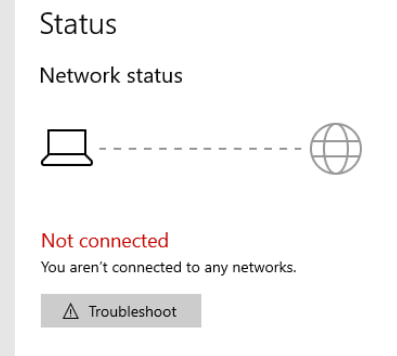
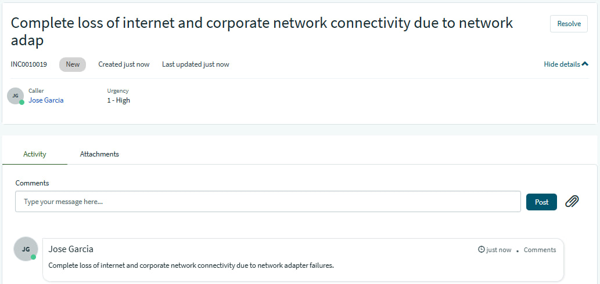
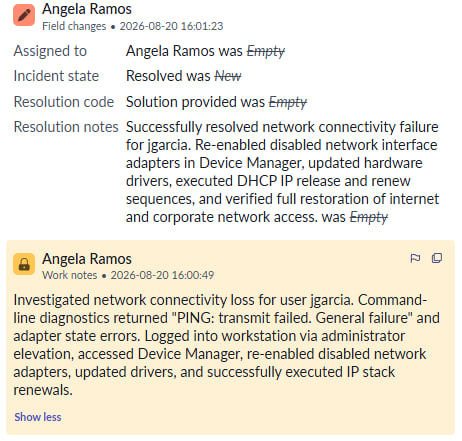
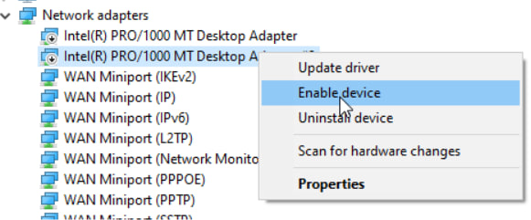
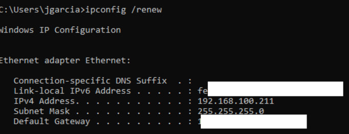
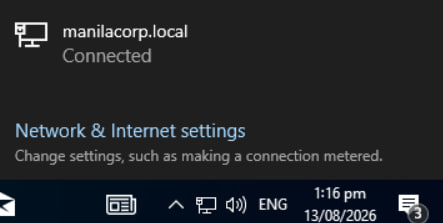

## INC0010019: Network Adapter Driver Failure & Connectivity Restoration

---

### Incident Summary

* **Incident ID:** INC0010019
* **Title:** Network Adapter Driver Failure & Connectivity Restoration
* **Environment:** Windows 10/11 Workstation, Device Manager, Command Prompt, ServiceNow PDI
* **Impacted Components:** Network Interface Cards (NIC), Hardware Drivers, Local Area Connectivity

---

### Issue Description

User `jgarcia` reported a complete loss of internet and corporate network connectivity, noting that the status showed "Not connected." Diagnostic tests executed via the command line returned critical network failures:

* `ping` commands failed with the error: `PING: transmit failed. General failure`
* `ipconfig /release` failed with the error: `The operation failed as no adapter is in the state permissible for this operation.`

---

### Root Cause Analysis (RCA)

1. **Disabled Hardware State:** The workstation's network interface adapters had been disabled, leaving no active physical or virtual communication channels available for the operating system.
2. **Network Stack Inaccessibility:** Because all adapters were in an inactive/disabled state, IP configuration commands could not query or manipulate interface states, resulting in command-line execution errors.

---

### Troubleshooting Steps Taken

* **Privilege Elevation:** Switched context and logged into the workstation using an administrator account to gain permissions to modify hardware and device settings.
* **Device Manager Inspection:** Navigated to **Device Manager** and located the disabled network adapters.
* **Hardware Re-enablement:** Right-clicked and re-enabled all network adapters to restore hardware bus communication.
* **Driver Maintenance:** Updated the network adapter drivers to ensure stability and proper handoff with the operating system PnP manager.

---

### Resolution & Implementation

1. **Session Transition:** Switched back to the user account (`jgarcia`) to verify operational status under standard user permissions.
2. **Network Stack Verification:** Executed baseline networking commands (`ipconfig /release` followed by `ipconfig /renew`) from an elevated command prompt to successfully clear and re-establish a dynamic IP address via DHCP.
3. **Verification:** Confirmed that network connectivity indicators returned to a healthy state, allowing `jgarcia` to access the internet and corporate network resources successfully.

---
  
### ITSM Incident Lifecycle & Knowledge Documentation (ServiceNow)
* **Ticket Intake (Service Portal):** The impacted end-user (`jgarcia`, Juan Garcia) submitted the network connectivity issue via the ServiceNow Service Portal (`INC0010019`).
* **Triage & Assignment:** Routed the ticket to the **IT Support** assignment group and assigned ownership for handling endpoint hardware and network driver troubleshooting.
* **Work Notes & Diagnostics:** Logged active troubleshooting steps detailing the Device Manager adapter re-enablement, driver updates, and command-line IP renewals directly into the incident work notes.
* **Resolution Details:** Updated the Resolution Information tab by setting the Resolution Code to **“Solution Provided”**, appending detailed resolution notes outlining the network card recovery fix.

---

### Evidence & Documentation
Device Manager Adapter Management and Network Stack Restoration

| Network Adapters Re-enabled | Successful IP Config Renew | Connected To The Network |
| :---: | :---: | :---: |
|  |  |  |
