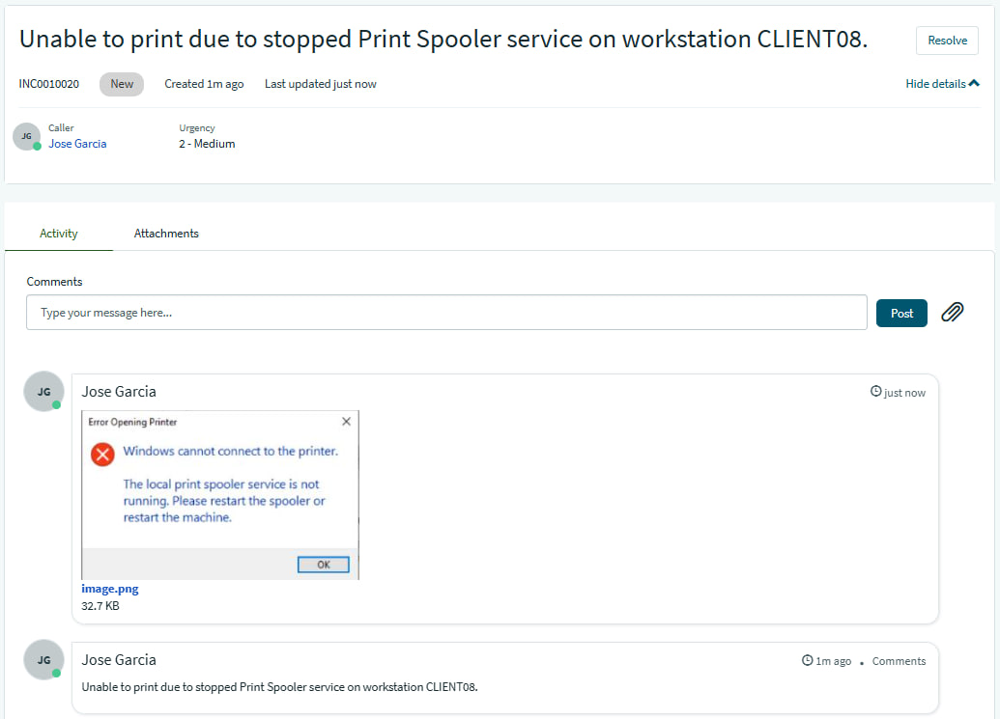
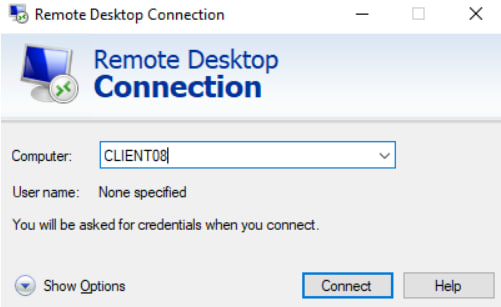
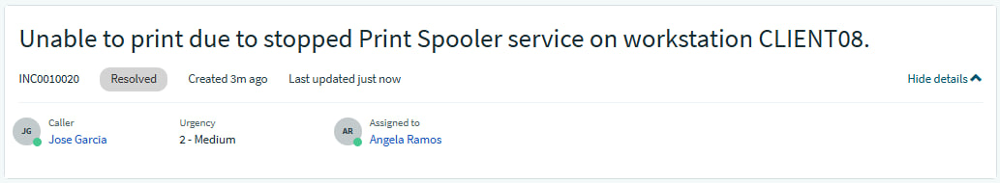
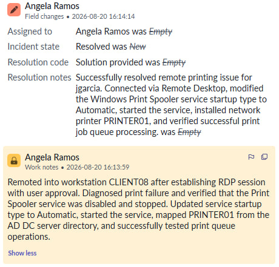
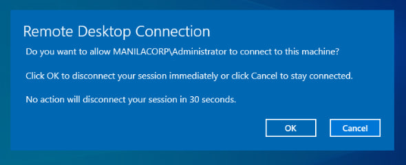
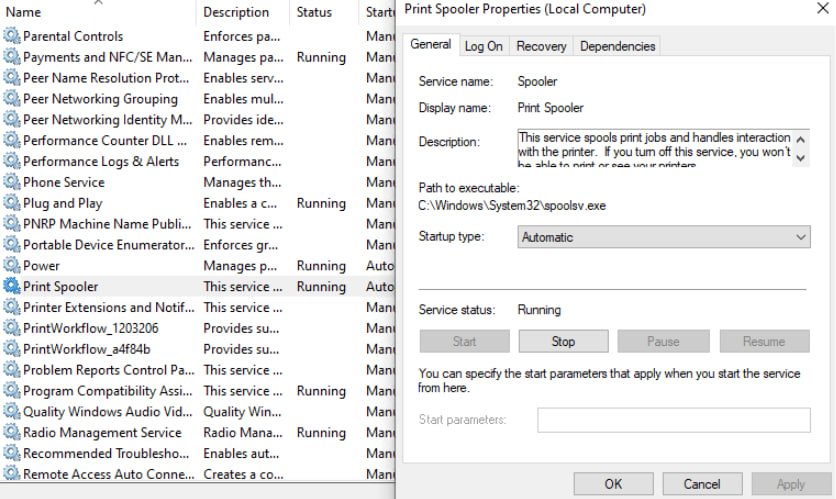
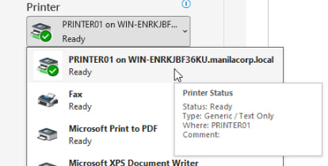

## INC0010020: Print Spooler Recovery & Remote Desktop Connectivity

---

### Incident Summary

* **Incident ID:** INC0010020
* **Title:** Print Spooler Recovery & Remote Desktop Connectivity
* **Environment:** Windows Workstation, Microsoft Remote Desktop Connection, Services Management (`services.msc`), Active Directory Domain Controller, ServiceNow PDI
* **Impacted Components:** Remote Desktop Protocol (RDP), Print Spooler Service, Print Queues

---

### Issue Description

User `jgarcia` reported an inability to print, noting an error message stating: *"The local print spooler service is not running. Please restart the spooler or restart the machine."* Because IT support was off-premise, a remote session was required to diagnose and resolve the issue. The stalled print spooler prevented local print driver installations and job processing.

---

### Root Cause Analysis (RCA)

1. **Service Failure:** The Windows **Print Spooler** service was configured to a disabled state and was not running locally on the workstation, breaking the local printing subsystem.
2. **Remote Access Barrier:** Resolving the issue required establishing an authorized remote desktop connection and verifying that remote access permissions and network connectivity were correctly configured between endpoints.

---

### Troubleshooting Steps Taken

* **Remote Connection Preparation:** Contacted `jgarcia` to obtain the remote workstation computer name (`CLIENT08`).

  

* **Connectivity & RDP Verification:** Inspected both ends for network connectivity and ensured that remote connections (`Allow remote connections to this computer`) were properly enabled via the control panel.
* **Session Handshake:** Launched the **Remote Desktop Connection** utility, targeted `CLIENT08`, and requested access while `jgarcia` approved the remote access prompt.
* **Directory & Network Integration:** Verified printer mapping by checking that network printers (such as `PRINTER01`) were visible in the directory list sourced from the Active Directory Domain Controller (AD DC) server.

---

### Resolution & Implementation

1. **Service Console Access:** Remotely opened the system **Services** manager (`services.msc`) using administrative privileges.
2. **Print Spooler Remediation:** Located the **Print Spooler** service, identified that it was stopped and disabled, and changed its startup type to **Automatic**, successfully changing its status to **Running**.
3. **Queue Verification:** Added the required printer to the user's computer and verified successful operation through the print queue monitor (*See what's printing*).

---
  
### ITSM Incident Lifecycle & Knowledge Documentation (ServiceNow)
* **Ticket Intake (Service Portal):** The impacted end-user (`jgarcia`, Juan Garcia) submitted the print spooler issue via the ServiceNow Service Portal (`INC0010020`).
* **Triage & Assignment:** Routed the ticket to the **IT Support** assignment group and assigned ownership for handling remote desktop assistance and printing subsystem recovery.
* **Work Notes & Diagnostics:** Logged active troubleshooting steps detailing the RDP handshake, AD DC printer directory mapping, and Services console configuration directly into the incident work notes.
* **Resolution Details:** Updated the Resolution Information tab by setting the Resolution Code to **“Solution Provided”**, appending detailed resolution notes outlining the print spooler restart and queue validation fix.

---

### Evidence & Documentation
Remote Session Authorization and Print Spooler Service Configuration

| Remote Desktop Connection Approval | Print Spooler Service Set to Automatic / Running | Printer Status Ready | 
| :---: | :---: | :---: |
|  |  | 
